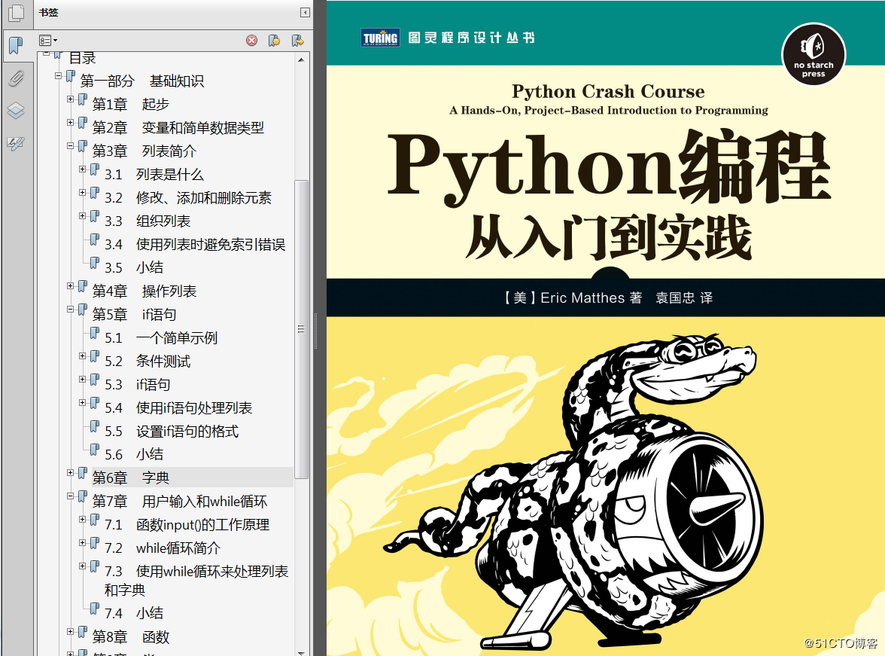
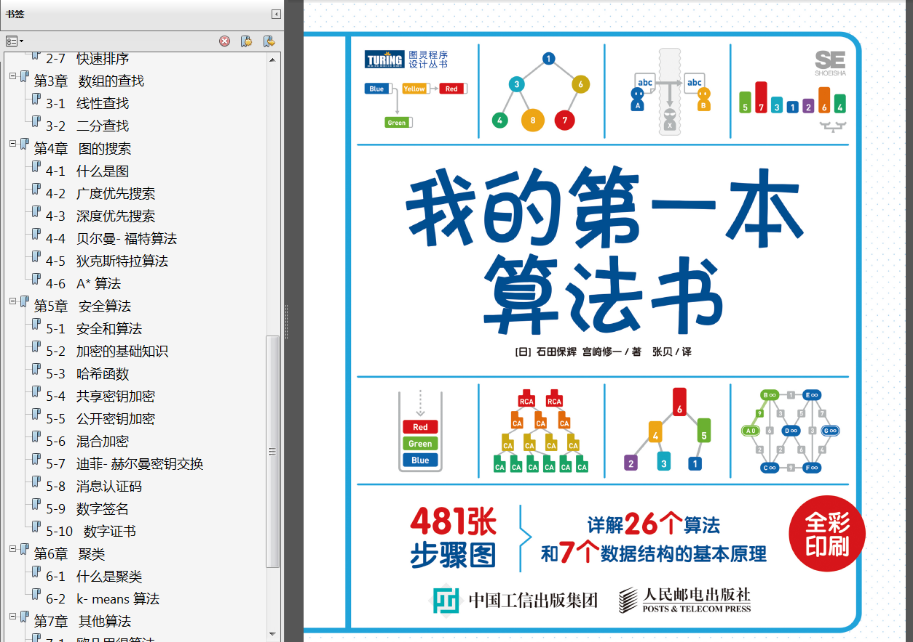
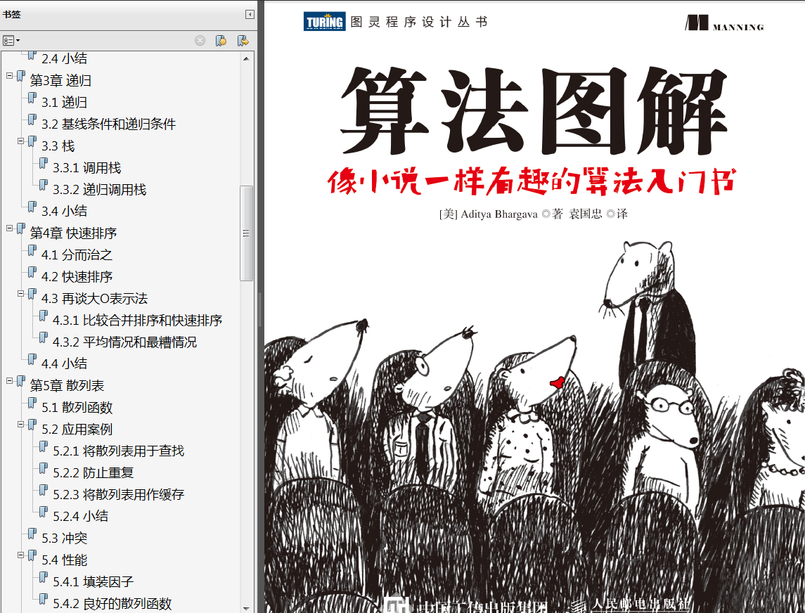
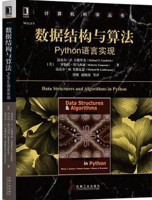
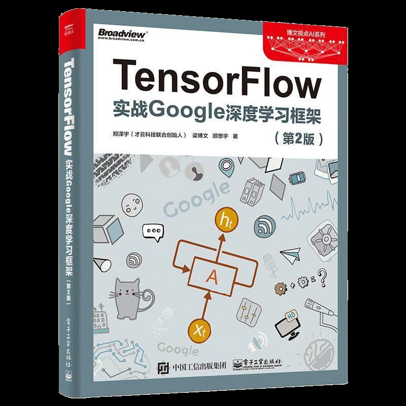

[语言](#语言)  
[数据结构与算法](#数据结构与算法)  
[tensorflow](#tensorflow)  
[机器学习](#机器学习)

# 相关书籍推荐  
	此仓库为自己记录学习笔记和学习过程的仓库，本人学习方向为深度学习。学习初级阶段，我看了一些书，能够帮助新手    理解和上手，我在这里也推荐给大家。主要分为语言、数据结构与算法、tensorflow和机器学习。  

## 语言  
	我是初学者，学习的是python，所以是通过看书和网上教程上手的，推荐我认为很适合初学者Python书籍《Python从    实践到入门。还有一些视频教程大家可以在我的[百度云](https://pan.baidu.com/disk/home?#/all?vmode=list&path=%2Fpython)下载。  
  

 

## 数据结构与算法  
	数据结构与算法，是很基础的东西，可以方便理解不同的数据选择的存储方式和调用方式不用的原理，在不同的场景选择   最合适的数据存储和算法。新手非常推荐我的《第一本算法书》和《算法图解》，后期可以啃《数据结构与算法》。我们   自己也写了一些[数据结构的入门教程](hhttps://github.com/liuzhen153/play-algorithm-python)。  
  
  
  

## tensorflow  
	tensorflow和pytorch是一直都比较火的两个框架，目前稳定版来说tensorflow是静态图，也就是只有当你将所有  神 经结构写好之后，在session中调用他才会运行；而pytorch是动态图可以随时查看输出和神经网络结构。但是现在的   tensorflow2.0也变成了动态图，功能也更加强大。所以我学习的是tensorflow，推荐的书籍是《Tensorflow实战  google深度学习框架》。  

## 机器学习   
	神经网络结构模型比较好学，但是理解为何这样设计，如何达到最终回归和分类效果比较难。为了更好的理解深度神经网络  我看了《机器学习（周志华著）》这本书，其中第五章很详细的解释了神经网络的数学模型，再结合矩阵线代更好的理解  深度神经网络。  
